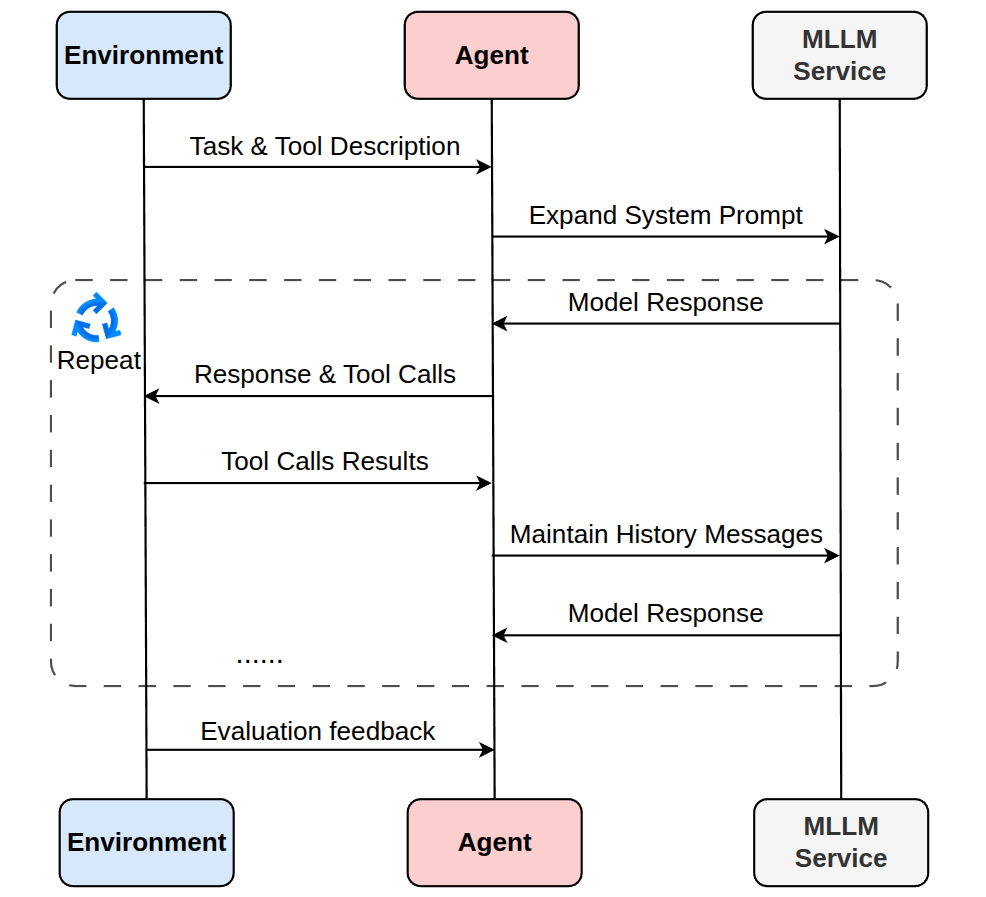

# EvoEnv

**EvoEnv** is a unified environment framework designed for assembling and executing multiple agent benchmarks with consistent interfaces and tooling. It empowers researchers and developers to build, run, and evaluate benchmark scenarios through a modular combination of configurable agents, tools, and environments.

## 🚀 Key Features

- 🧩 **Modular Assembly**: Seamlessly combine environments, agents, and tools to create diverse scenarios.
- ⚙️ **Configurable**: Benchmark generation is driven by configuration files to ensure experiments are repeatable.
- 🔌 **Extensibility**: Native support for integrating custom tools and agents.

## 🛠️ Development Setup

**Prerequisites:**
- Python 3.10+
- [uv](https://github.com/astral-sh/uv) (A fast Python package installer and resolver).

**Installation Steps:**

1.  **Clone the repository:**
    ```bash
    git clone https://github.com/KnowledgeXLab/EvoEnv.git
    cd EvoEnv
    ```

2.  **Set up the environment:**
    This project uses `uv` for dependency management.
    ```bash
    # Create the virtual environment and sync dependencies
    uv venv
    uv sync
    ```

    > **Note:** `uv sync` reads the `pyproject.toml` file to install the exact versions of dependencies required for this project.

## 🏆 Run Environment

Currently, EvoEnv supports the following benchmarks:

- **[TraineeBench](docs/TraineeBench.md)**: See the documentation for instructions on configuration, instance generation, and running the example harness.


## 🧩 Core Components
<div align="center">
  
</div>
<br>

EvoEnv defines a standardized interaction protocol bridging the **Environment**, **Agent**, and **MLLM Service**. This pipeline orchestrates the iterative cycle of observation, reasoning, and tool execution while abstracting key components to support reliable benchmarking.

### 1. Environment
The central hub managing the simulation lifecycle. It initializes the workspace, registers tools, and dictates the simulation dynamics. It consists of four key modules:

*   **Workspace Manager**: Initializes the sandbox from `config.json`, sets up the file system, and dynamically generates system prompts with task descriptions.
*   **Virtual Time System**: A built-in `VirtualClock` simulating temporal dynamics. Unlike static benchmarks, every tool execution advances internal system time based on defined action cost, forcing agents to treat time as a critical resource.
*   **Tool Execution Gateway**: A robust middleware (`execute_tool_calls`) between the agent and virtual servers. It parses arguments, handles runtime errors, captures outputs, and injects the current virtual time into observations.
*   **Evaluation Pipeline**: An automated assessment module (`evaluate`) that verifies task completion. It compares the final workspace state against ground truth criteria to generate detailed scoring reports.

### 2. Agent
The decision-making entities interacting with the environment. EvoEnv provides abstract interfaces to:

*   `set_task_prompt`: Injects the initial task requirements and context into the agent's memory.
*   `step`: Executes a single interaction cycle—sending observations to the LLM, parsing actions, executing tool calls via `env.execute_tool_calls`, and updating history.
*   `forward`: The main execution loop that autonomously calls `step` repeatedly until the `all_tasks_done` signal is triggered or the maximum step count is reached.

### 3. Customization & Extension
EvoEnv is designed for extensibility. You can:

- **Add new tools** — add tools to the `toolbox/` directory; ensure tools follow the required call signature so the environment can invoke them reliably.
- **Add new agents** — implement the agent interface (for example, `set_task_prompt`, `step`, and `forward`) to integrate novel architectures or controllers.


## 🎮 Human Interface
EvoEnv includes a built-in **Web Viewer** to visualize and inspect agent traces. This allows researchers to debug interactions and analyze agent behavior step-by-step. Below is a usage example. After creating an instance of [TraineeBench](docs/TraineeBench.md), run the following command.

```bash
uv run human_interface.py \
--task-root benchmarks/traineebench/scenario_4kmtZc7e5NC2iAoTgNDsTG/day_1 \
--log-path human_interface.log
```

Then, access http://127.0.0.1:8000 in your browser to view the interactive interface shown in the following image.

<div align="center">
  
</div>
<br>

## 🤝 Contributing

Contributions are welcome! Please open issues or pull requests to improve the framework.

**Adding a New Benchmark?**
If you are contributing a new benchmark, please provide:
1.  Scripts and configuration files under `environments/`.
2.  A dedicated README under `docs/` explaining inputs, expected agent behaviors, and execution instructions.
